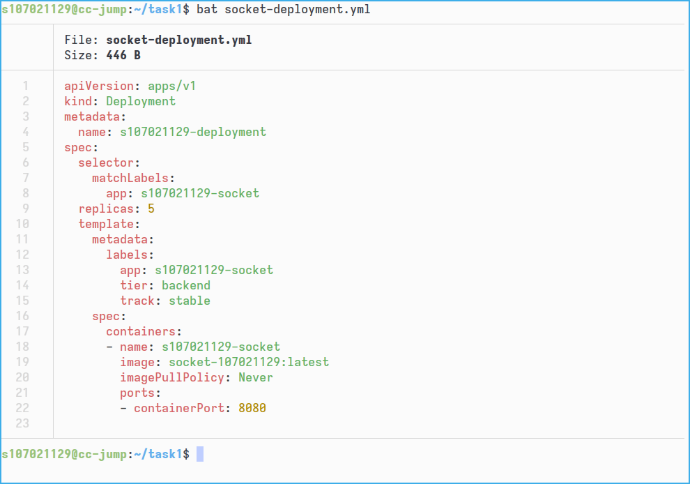

# A. Screenshots for Task 1

# B. Screenshots for Task 3

The client was modified to read destination IP and port from stdin.

# C. Performance of Container vs VM (Task 2)

All the experiments are ran for at least 3 times,
and the average values is presented in the following table.

| Item | VM | Container |
|------|----|-----------|
| Sysbench CPU (Events/s)| 18486 | 18630 |
| Sysbench Memory (Events/s) | 61141029 | 65703919 |
| Sysbench File IO (Events/s) | 17737 | 1066502 |
| iperf (Gbps) | 1.19 | 9.68 |

In terms of CPU and memory performance,
there is no dramatic difference between the VM and the container.
With the help of KVM, the VM inside QEMU run pretty much as well as the container,
with very minor performance hit.

File IO speed in the VM is severely impacted by the fact that the file operations goes through the qcow2 disk image format,
which,
as described in the documentation of QEMU,
"has the largest overhead compared to raw images when it needs to grow the image".
Since the experiments were done in a fresh VM,
the images had not allocated the space required for the files written by sysbench,
and did the allocation on-the-fly while sysbench runs,
causing file IO to be very slow.

`iperf` shows that the container has a huge advantage (with more than 8 times better throughput) in communicating with the host machine via network,
since the network traffic is essentially travelling between processes on the host itself.

# D. Difference between Docker Container and VM

As opposed to virtual machines, which are themselves fully virtualized systems,
Docker containers are essentially a bunch of carefully managed and restricted processes
running on the same host.
This enables containers to be much more lightweight
and enables better sharing of the computational resources on the host
(for example, memory allocation and overcommitting is much more easier),
at the cost of having less isolation and security.

Docker containers typically have different use cases than virtual machines.
Docker containers are nowadays mainly used for deploying stable development and production environments,
which is not commonly done using virtual machines due to the bloat of virtual machine images.

# E. Explain "Deployment", "Service" and "Pod"

## Deployment

*Deployment* in Kubernetes is a declarative way to specify how to create and manage the *pods*
that constitutes a container app.
Typically things like the container images to be used
and the number of replicas are specified in a deployment.

## Service

A *service* in Kubernetes groups one or more pods in a cluster as a logical application,
presenting them to the outside world as a network service.
In this assignment, a `NodePort` service is used to expose the socket service on all nodes.

## Pod

A *pod* in Kubernetes is an instance (or several instances) of running Docker containers,
and is the smallest unit of execution.
When there are multiple containers inside a single pod,
the containers share network and storage resources.

# F. Kubernetes

Kubernetes is a system for managing containerized applications and services.
It provides us with many features such as *service discovery* (exposing container with a DNS name),
*rollouts* and *rollbacks* (gradually reaping old instances and creating new ones),
*fault tolerance* (restarts unheathy instances),
*load-balancing*, and more.

The need of Kubernetes stems from the fact that managing containers *across multiple servers* at scale is hard.
Kubernetes presents a tightly integrated interface and declarative configurations,
which allows the operators to do so in a maintainable way.

# G. Container Technology

# H. Container Data
